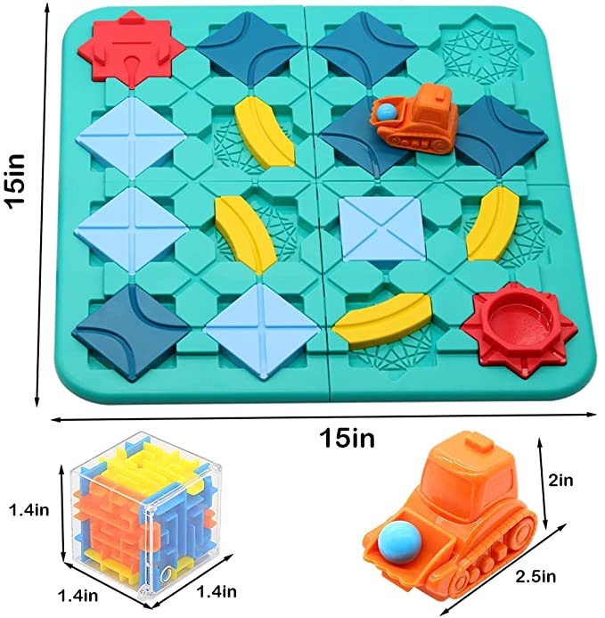
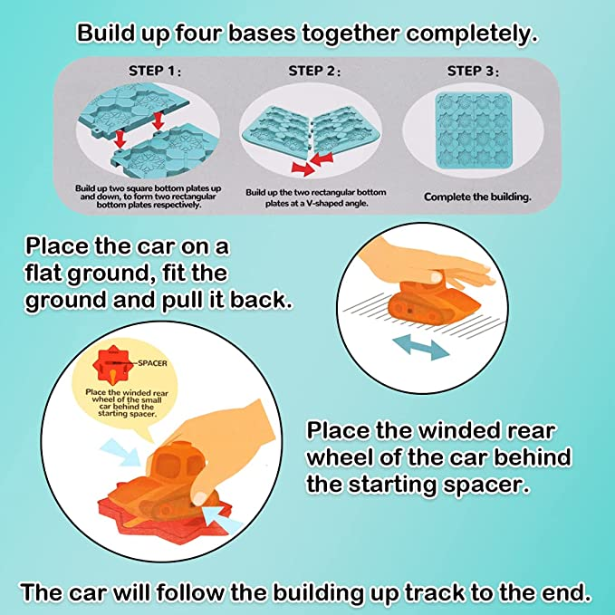

# Logical Road Build Game
Create a Logical Road Builder Game using GUIs in Java
https://inspirishop.com/product/logical-road-builder-game/

The game board have width of 15 inches and height of 15 inches. The 4 basic road builder (3.75 inch wide and 3.75 high) are combined together to form a game board. For this task, we are required to do anything with the maze cube. Each group can create their own 4 challenges for their task and player can try to find a solution for each challenge by placing the provided accessories on the game board to move the vehicle from the start position to the end position. Once the player have found a solution for the challenge then the vehicle should follow the path over the accessories placed on the game board to reach the end position. 

# Additional Details

